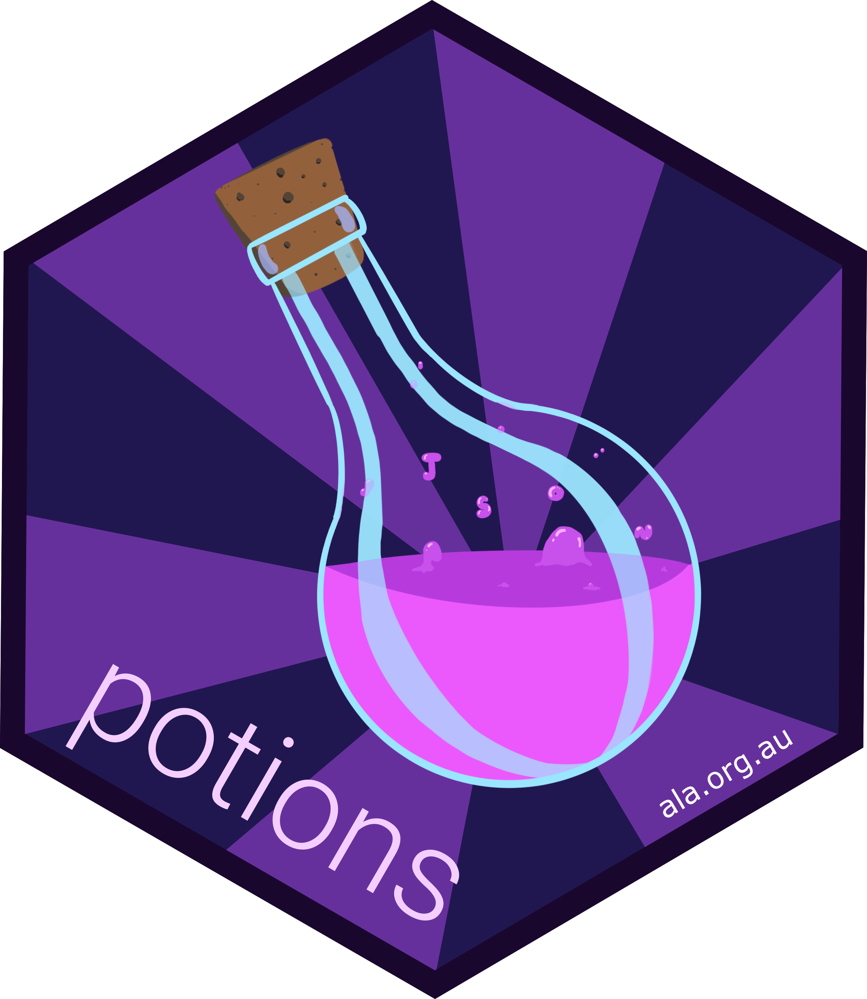

<!-- README.md is generated from README.Rmd. Please edit that file -->

```{r, echo = FALSE}
knitr::opts_chunk$set(
  collapse = TRUE,
  comment = "#>"
)
```

<h2>easy options management</h2>

Often it is useful to set bespoke options for a single workflow, or within a 
single package, without altering global options that influence other users or 
packages. This is possible using `base::options()` and related functions, 
however doing so requires care, and occasionally some bespoke knowledge. 
`potions` makes options management as easy as possible, by decreasing 
programmers' cognitive burden while storing and retrieving information. It does 
this by following three guiding principles:

- **minimalist**: `potions` has only three core functions: `brew()`, `pour()` and `drain()`
- **laconic**: functions use as few characters as possible
- **familiar**: uses a UI for data retrieval based on the `here` package

In combination, these features should make it easy for users and developers to 
manage options using `potions`.

To install from CRAN:
```{r eval=FALSE}
install.packages("potions")
```

To install from GitHub:
```{r eval=FALSE}
install.packages("remotes")
remotes::install_github("atlasoflivingaustralia/potions")
```

To store data in `options()`, use `brew()`
```{r}
library(potions)
brew(list(x = 1, y = list(a = 2, b = 4))) # use a list

brew(x = 1) # or as named arguments
```
  
Then you can use `pour()` to get the information you need:
```{r}
pour() |> str() # get all data

pour("x") # get a subset of data

pour("y", "a") # for nested data
```

When you are done, simply use `drain()` to clean up:
```{r}
drain()

pour() # nothing to return
```
