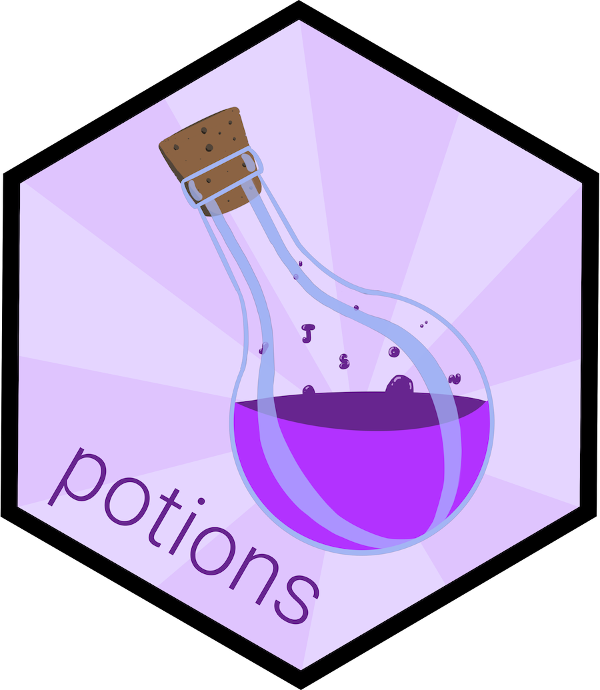

<h2>potions</h2>

lightweight options management in R, designed to act like pkg 
[`here`](https://cran.r-project.org/package=here), but for nested lists in 
options. Currently experimental. For more comprehensive options
management try [`settings`](https://cran.r-project.org/package=settings).

`potions` contains three functions:
* `brew()` puts a (nested) `list` into a slot in `options` with a user-specified name
* `pour()` retrieves a value from that list, selected via one or more slot names
* `drain()` empties the user-specified `options` slot

Example:
```
# set some example data
options_list <- list(
  data = list(x = 1, y = 2),
  metadata = list(a = 10, b = 12))
  
# place in options
brew("potions_example", options_list)
  
# extract values using `here()`-like syntax
pour("data", "x")
[1] 1
pour("data", "y")
[1] 2
pour("data", "x", slot_name = "something_else")
NULL

# clean up
drain()

# prove cleanup worked:
getOption("potions_example")
NULL
```

To use in a package development situation, set `onLoad.R` to
```
.onLoad <- function(libname, pkgname) {
  if(pkgname == "my_package_name_here") {
    potions::brew(.pkg = "my_package_name_here")
  }
}
```